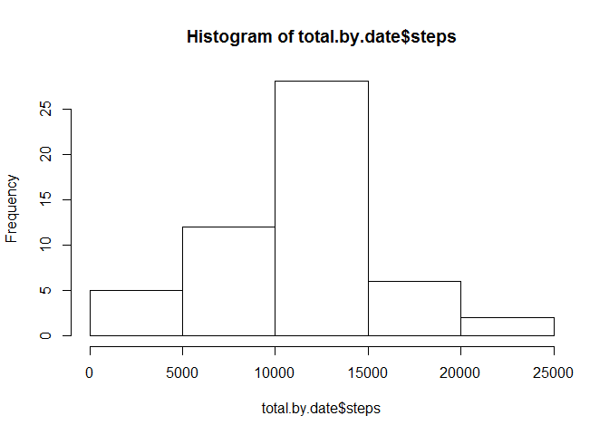

# Reproducible Research: Peer Assessment 1


## Loading and preprocessing the data

We're loading the data directly, without unzipping it


```r
activity <- read.csv(unz("activity.zip", "activity.csv"))
```

## What is mean total number of steps taken per day?

We're creating a new data frame with total amount of steps aggregated by date
and plotting a histogram of this data 


```r
total.by.date <- aggregate(steps ~ date, data = activity, sum)
hist(total.by.date$steps)
```

<!-- -->

We can check out the mean and median of the total number of steps taken per day
by calculating some summary statistics of aggregated data frame


```r
summary(total.by.date$steps)
```

```
##    Min. 1st Qu.  Median    Mean 3rd Qu.    Max. 
##      41    8841   10760   10770   13290   21190
```

So the mean is 10770, and the median is 10760

## What is the average daily activity pattern?

To explore the average daily activity pattern we'll first load dplyr package


```r
library(dplyr)
```

now we can easily group data frame and calculate average number of steps taken per interval, averaged across all days


```r
aver.by.interv <- activity %>% group_by(interval) %>% summarise(steps = mean(steps, na.rm = TRUE))
```

and make a time series plot of the 5-minute interval (x-axis) and the average number of steps taken, averaged across all days (y-axis) using ggplot2 package (we'll load it first)


```r
library(ggplot2)
ggplot(aver.by.interv, aes( x = interval, y = steps)) + geom_line()
```

<!-- -->


## Imputing missing values


## Are there differences in activity patterns between weekdays and weekends?
